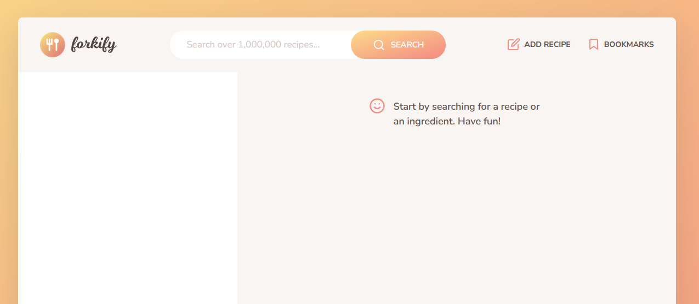
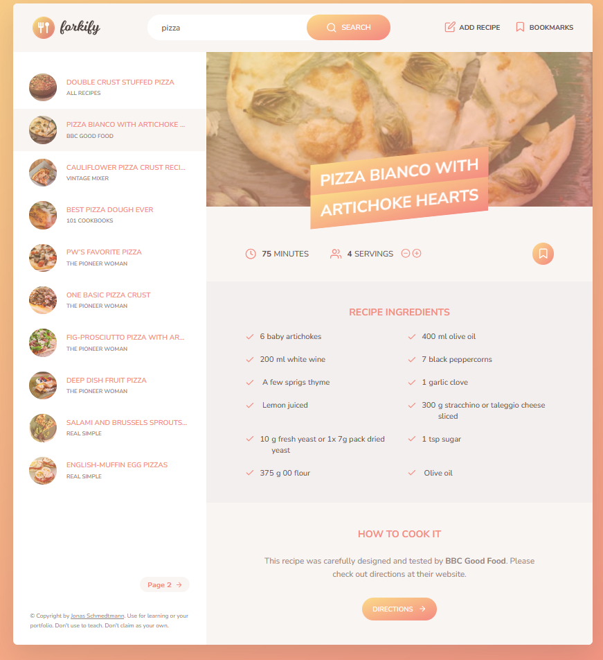
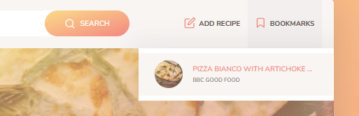
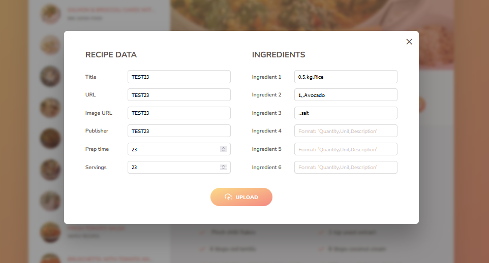

# Forkify Project

From the complete JavaScript Couse by [Jonas Schmedtmann on Udemy](https://www.udemy.com/course/the-complete-javascript-course/?couponCode=ST18MT12125)

In this project a page is created for the search of recepies from a favorite plate name like "pizza", "spaghetti", "tomato" and so on.

It will return:

<ul>
  <li>A list os recipe ideas</li>
  <li>Name and ingredients</li>
  <li>Servings, being able to change the number</li>
  <li>How to make the dish</li>
</ul>

This project is based on the use of JavaScrip API.

Main Page

Pizza results

Bookmark

Add recipe

